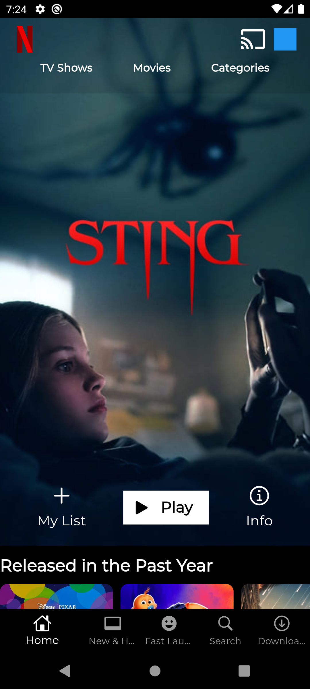
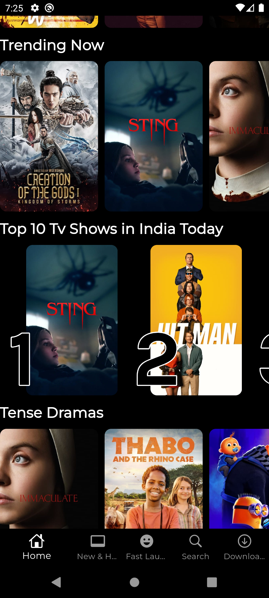
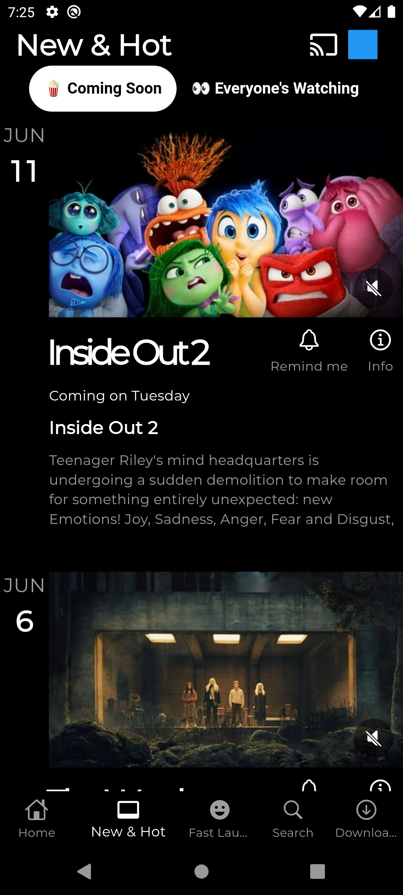
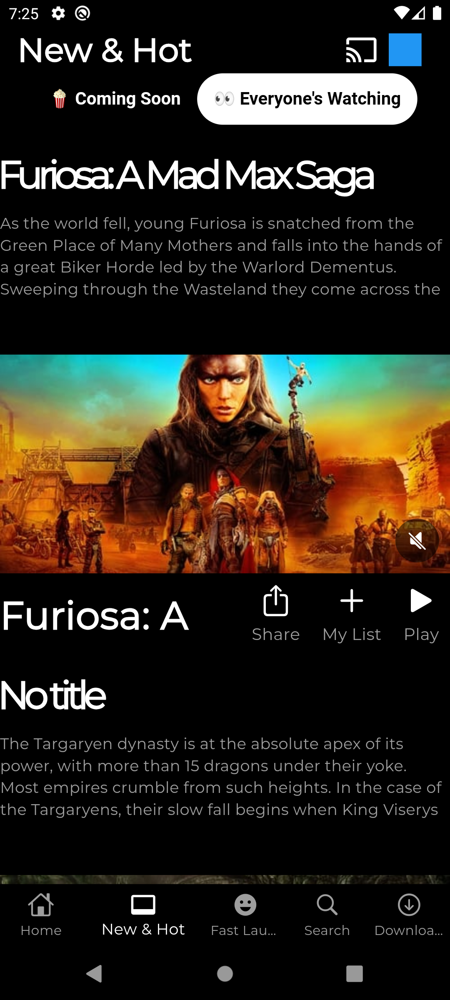
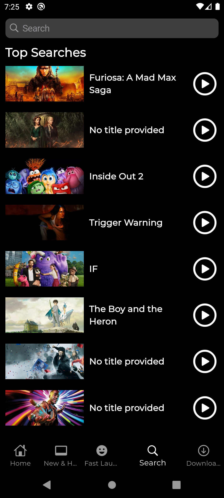
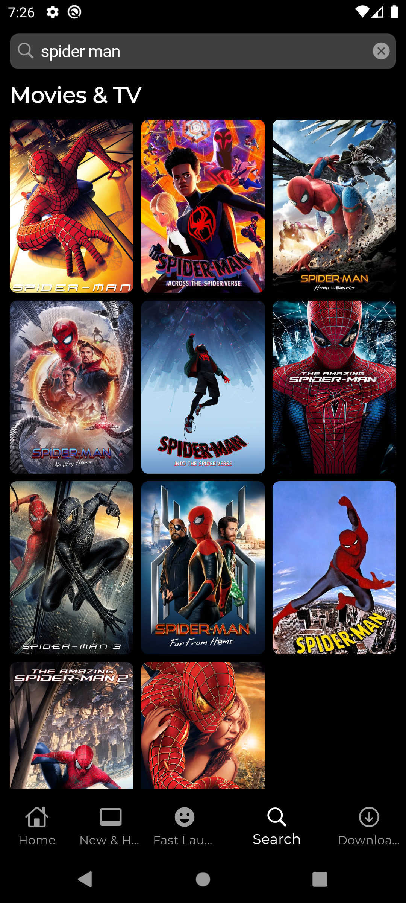
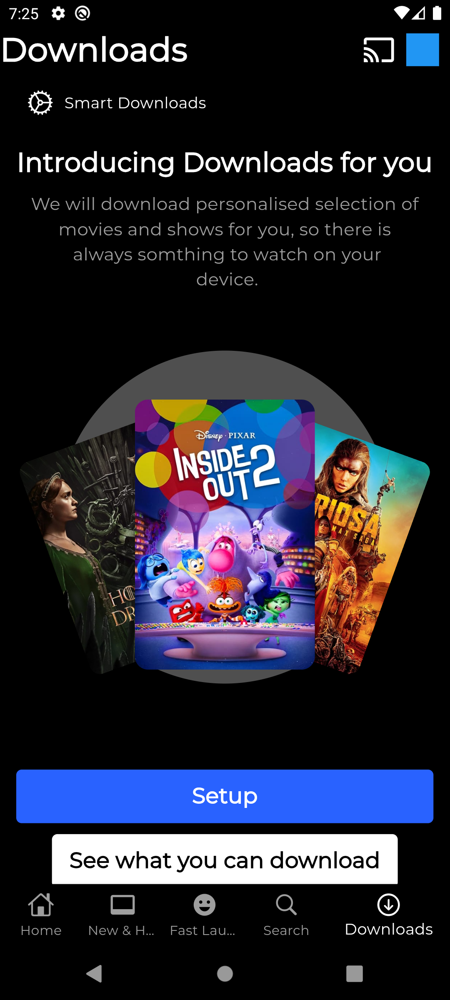

# Flutter Netflix Clone

This app is built using Flutter and is a basic Netflix clone leveraging TheMovieDB API. It utilizes the BLoC state management pattern and follows the Domain-Driven Design (DDD) architecture.

## Features

- **Home Page:** Display popular and trending movies.
- **New & Hot Page:** Show upcoming and currently popular content.
- **Fast Laugh Page:** View videos similar to reels using the Pexels Video API.
- **Search Page:** Search for movies and TV shows.
- **Download Page:** View and manage your downloaded content.

## Technologies Used

- Flutter
- BLoC (Business Logic Component)
- DDD (Domain-Driven Design) Architecture
- TheMovieDB API
- Pexels Video API

## Screenshots

<p align="center">

    
    
    
    
    
    
    
</p>

## Installation

```bash
git clone https://github.com/mu-fazil-vk/netflix.git
cd netflix
flutter pub get
flutter run
```

## Contributing
Contributions are welcome! Please create a pull request or open an issue for any feature requests or bugs.